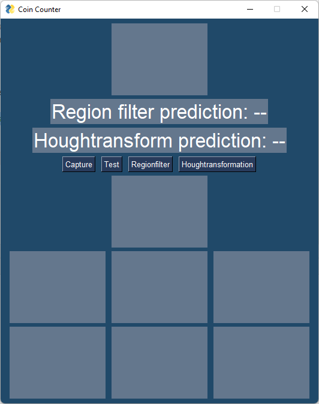
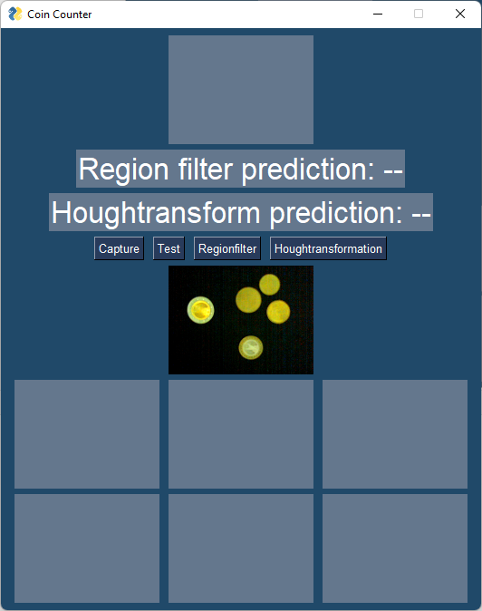
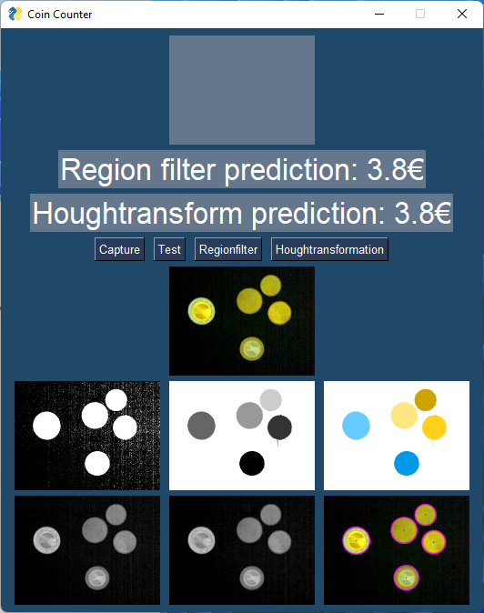

# Coincounter

## Preparation

1. create a virtual python environment and install the dependencies

Windows
```PowerShell
Set-ExecutionPolicy RemoteSigned-Scope CurrentUser # This allows you to run Scripts in the Commandline/Powershell
python -m venv ./venv
.\venv\Scripts\activate.ps1
pip install -r requirements.txt
```

Linux
```bash
python -m venv ./venv
.\venv\Scripts\activate
pip install -r requirements.txt
```

## Start the Programm

```bash
./src/coincounter.py
```
or use
```bash
python ./src/coincounter.py
```

## Usage



Now you can either load the test Picture or capture a new one with your Webcam.


Next you can use either the Regionfilter Methode and/or the Houghtransformation Methode
to get a Prediction for the Coins in the Picture.



This Project is brought to you by @MSchmidtHTWG @nstre and @blacksquirrel16